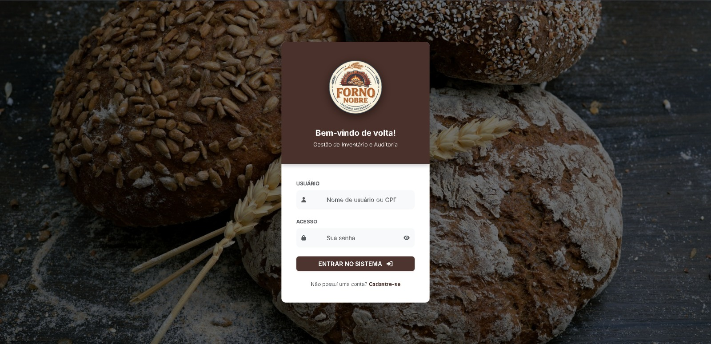
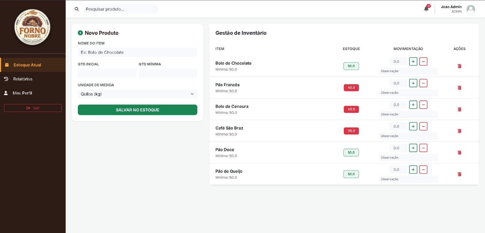
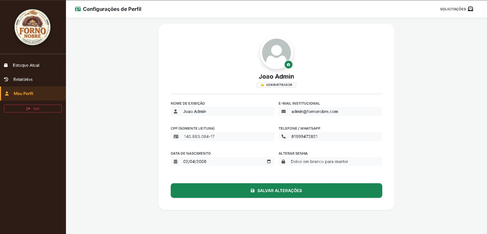

# Forno-Nobre-Sistema-de-Estoque
Um sistema de estoque básico para uma padaria com controles de nível de acesso "Administrador/Funcionário".

# 🥖 Forno Nobre - Sistema de Gestão de Estoque

O **Forno Nobre** é uma aplicação web desenvolvida para facilitar o controle de insumos em padarias artesanais. O sistema permite o monitoramento de estoque em tempo real, auditoria de movimentações e gestão de acessos.

## 🚀 Funcionalidades

- **Gestão de Estoque:** Cadastro de insumos com alertas automáticos de quantidade mínima.
- **Níveis de Acesso:** Diferenciação funcional entre Administradores e Funcionários.
- **Histórico Completo:** Registro detalhado de todas as entradas e saídas (quem, quando e quanto).
- **Sistema de Solicitações:** Alterações de perfil de usuários passam por aprovação prévia do administrador.
- **Interface Responsiva:** Notificações visuais (badges) para pendências administrativas.

## 🛠️ Tecnologias Utilizadas

- **Backend:** Python com Flask
- **Banco de Dados:** SQLite com SQLAlchemy (ORM)
- **Frontend:** HTML5, CSS3, Bootstrap 5 e FontAwesome
- **Controle de Versão:** Git/GitHub

## 📦 Como rodar o projeto

1. Clone o repositório:
git clone https://github.com/jadevbuilds/Forno-Nobre-Sistema-de-Estoque.git

## 📸 Demonstração Visual

Abaixo, algumas capturas de tela do sistema em funcionamento:

### 🔐 Tela de Acesso (Login)
Interface limpa e segura para autenticação de usuários, diferenciando acessos entre Administradores e Funcionários.

### 📦 Controle de Estoque
Visualização completa dos insumos, unidades de medida e alertas de estoque crítico.

### 👤 Perfil e Notificações Administrativas
Área personalizada onde o Administrador visualiza notificações de solicitações pendentes em tempo real.

### 📝 Histórico de Movimentações
Registro detalhado de todas as operações realizadas, garantindo a auditoria do estoque.

